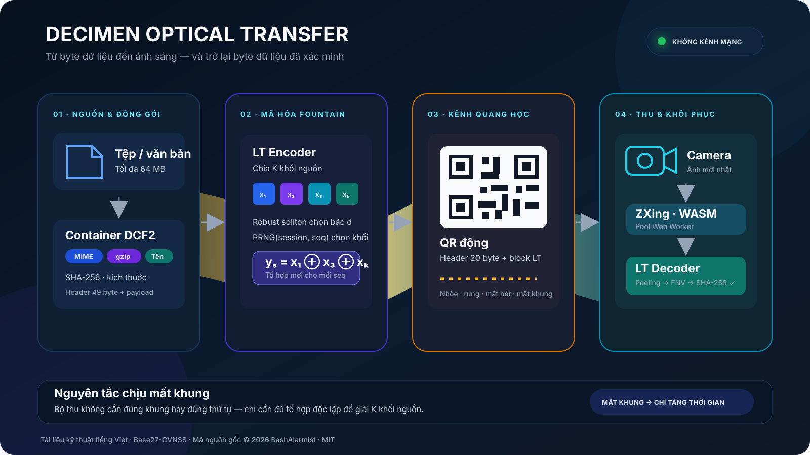
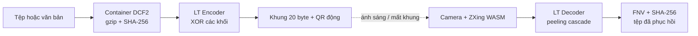
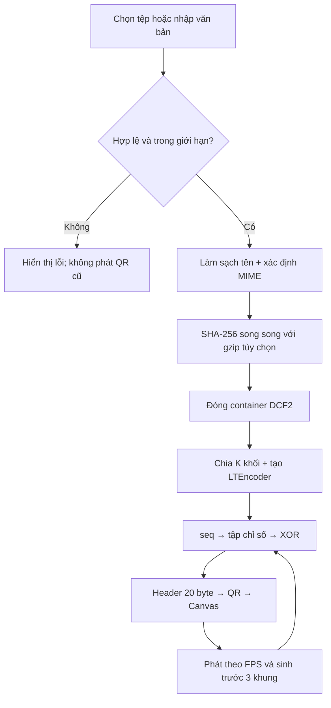
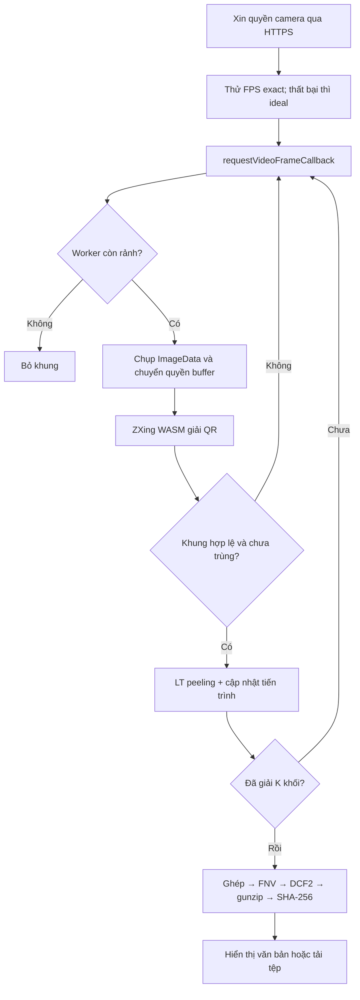

# 🔦 Decimen Optical Transfer

<div align="center">

**Truyền tệp và văn bản bằng ánh sáng: màn hình phát QR động, camera thu, không cần đường truyền mạng giữa hai thiết bị**

[](LICENSE)
[](https://www.typescriptlang.org/)
[](https://web.dev/explore/progressive-web-apps)
[](https://doi.org/10.1109/SFCS.2002.1181950)
[](#ban-chat)

[Bắt đầu nhanh](#cai-dat) · [Nguyên lý](#nguyen-ly) · [Kiến trúc](#kien-truc) · [Giao thức](#giao-thuc) · [Ứng dụng](#ung-dung) · [Nguồn gốc](#nguon-goc)

</div>

> [!IMPORTANT]
> Đây là bản thuyết minh kỹ thuật tiếng Việt của dự án **Decimen Optical Transfer**. Thuật toán và mã nguồn gốc do **BashAlarmist** công bố dưới giấy phép MIT. Kho gốc: [bashalarmistalt/decimen-optical-transfer](https://github.com/bashalarmistalt/decimen-optical-transfer). Bản Việt hóa giữ nguyên thông báo bản quyền trong [LICENSE](LICENSE).

---

<a id="tom-tat"></a>
## 📑 Tóm tắt khoa học

Decimen Optical Transfer là một hệ thống truyền dữ liệu quang học một chiều chạy hoàn toàn trong trình duyệt. Thiết bị gửi biến tệp hoặc đoạn văn bản thành một chuỗi QR động; thiết bị nhận dùng camera đọc các khung hình và tái tạo dữ liệu. Giữa hai thiết bị không cần Wi‑Fi, Bluetooth, cáp, ghép đôi hay một kết nối mạng dùng để chở tải tin. **Tải tin thực sự đi qua ánh sáng phát ra từ màn hình và đi vào cảm biến camera.**

Khó khăn cốt lõi của kênh màn hình–camera là không có đường phản hồi để yêu cầu phát lại khung bị mất. Chuyển động tay, rung, nhòe, sai nét, phơi sáng, lệch nhịp giữa tần số làm tươi màn hình và tốc độ camera đều có thể làm mất khung. Dự án giải quyết bài toán này bằng **mã Fountain kiểu Luby Transform (LT)**: mỗi QR không chứa một khối tệp cố định mà chứa phép XOR của một tập con khối nguồn được chọn giả ngẫu nhiên. Bộ thu không cần đúng khung, đúng thứ tự hay cùng tốc độ với bộ phát; nó chỉ cần thu đủ số khung độc lập để thuật toán “peeling” khôi phục toàn bộ khối nguồn.

Phiên bản hiện tại hỗ trợ tệp bất kỳ tối đa **64 MB**, bảo toàn tên tệp và kiểu MIME, nén gzip có điều kiện, kiểm tra nhanh toàn luồng bằng FNV‑1a và xác minh nội dung cuối bằng SHA‑256. Hệ thống có ba hình thức triển khai: website/PWA dùng ngoại tuyến sau lần tải đầu; một tệp HTML gửi độc lập; và một tệp HTML nhận độc lập kèm bộ giải mã WASM.

**Từ khóa:** truyền dữ liệu quang học, kênh xóa, mã Fountain, Luby Transform, QR động, WebAssembly, PWA, truyền ngoại tuyến, air gap, SHA‑256.

---

## 🧭 Mục lục

- [Bản chất của hệ thống](#ban-chat)
- [Bài toán nghiên cứu](#bai-toan)
- [Đóng góp kỹ thuật](#dong-gop)
- [Kiến trúc hệ thống](#kien-truc)
- [Nguyên lý khoa học](#nguyen-ly)
- [Định dạng dữ liệu và giao thức khung](#giao-thuc)
- [Logic phía gửi và phía nhận](#logic)
- [Cài đặt và chạy thử](#cai-dat)
- [Hiệu năng và tinh chỉnh](#hieu-nang)
- [Khi nào nên dùng](#ung-dung)
- [An toàn, bảo mật và giới hạn](#an-toan)
- [Cấu trúc mã nguồn](#cau-truc)
- [Kiểm thử, xây dựng và phát hành](#kiem-thu)
- [Hướng nghiên cứu tiếp theo](#huong-nghien-cuu)
- [Nguồn gốc, trích dẫn và ghi công](#nguon-goc)

---

<a id="ban-chat"></a>
## 🔬 Bản chất của hệ thống

Decimen **không phải** dịch vụ gửi tệp qua Internet và cũng không phải ứng dụng nhắn tin. Về bản chất, đây là một **modem quang học bằng phần mềm**:

| Thành phần truyền thông | Hiện thực trong Decimen |
|---|---|
| Nguồn dữ liệu | Tệp hoặc văn bản UTF‑8 |
| Bộ đóng gói | Container DCF2: tên, MIME, độ dài, SHA‑256, dữ liệu |
| Mã chống mất gói | LT Fountain với phân phối robust soliton |
| Đơn vị truyền | Khung nhị phân có header 20 byte |
| Điều chế/biểu diễn | QR Code thay đổi theo thời gian |
| Môi trường truyền | Ánh sáng từ màn hình đến camera |
| Nhiễu/kênh xóa | Nhòe, rung, mất nét, phơi sáng, lệch khung, khung chuyển tiếp |
| Bộ giải điều chế | ZXing‑C++ biên dịch WebAssembly chạy trong Web Worker |
| Bộ khôi phục | LT decoder và peeling cascade |
| Kiểm tra toàn vẹn | FNV‑1a toàn container + SHA‑256 tệp gốc |

Điểm quan trọng nhất là phân biệt hai lớp sửa lỗi:

1. **ECC bên trong QR** xử lý một phần lỗi điểm ảnh trong *một khung*.
2. **Mã Fountain giữa các khung** xử lý *mất cả khung*.

Trong cấu hình mặc định, QR dùng mức ECC thấp `L` để dành nhiều dung lượng cho tải tin. Nếu một khung quá xấu, hệ thống bỏ khung đó; mã Fountain bù phần bị mất bằng các khung khác.

---

<a id="bai-toan"></a>
## 🎯 Bài toán nghiên cứu

### 1. Kênh một chiều không có ACK

Thiết bị nhận chỉ quan sát màn hình thiết bị gửi. Nó không có đường phản hồi để báo:

- đã nhận khung nào;
- thiếu khung nào;
- cần phát lại số thứ tự nào;
- nên giảm tốc độ hoặc mật độ QR ra sao.

Nếu chỉ chia tệp tuần tự thành `K` mảnh rồi lặp vòng, mất một mảnh buộc người nhận chờ cả chu kỳ để gặp lại mảnh đó. Khi tệp lớn hoặc tỷ lệ mất khung cao, thời gian chờ có thể tăng mạnh và tiến trình thường bị “kẹt ở 99%”.

### 2. Đồng bộ màn hình–camera không lý tưởng

Màn hình và camera vận hành bằng các đồng hồ độc lập. Một ảnh camera có thể chụp đúng lúc màn hình đang chuyển từ QR thứ `s` sang QR thứ `s+1`, tạo khung lai không giải mã được. Tần số phát 60 FPS cũng không đồng nghĩa camera thực sự cung cấp 60 FPS; đặc biệt trên iOS, yêu cầu `ideal: 60` có thể chỉ nhận 30 FPS.

### 3. Bộ thu di động có tài nguyên hữu hạn

Giải mã QR độ phân giải cao liên tục bằng WASM tiêu tốn CPU và bộ nhớ. Nếu xếp hàng mọi ảnh camera, bộ thu sẽ tích lũy các khung cũ và tăng độ trễ. Decimen chọn chiến lược phù hợp với mã Fountain: **khi mọi worker bận, bỏ khung hiện tại thay vì xếp hàng**. Khung kế tiếp có giá trị tương đương về mặt xác suất và mới hơn.

---

<a id="dong-gop"></a>
## ✨ Đóng góp kỹ thuật

### Đóng góp cốt lõi

- 📡 **Truyền quang một chiều, không bắt tay:** bộ thu có thể tham gia giữa luồng.
- ⛲ **Mã Fountain không giới hạn trước số khung:** bộ phát tạo tiếp các tổ hợp mới cho đến khi người dùng dừng.
- 🧩 **Khôi phục không phụ thuộc thứ tự:** mất khung làm tăng thời gian, không làm sai nội dung nếu cuối cùng thu đủ thông tin.
- 🧮 **Tính xác định liên động cơ JavaScript:** hàm log tự xây dựng bằng các phép IEEE‑754 xác định để V8 và JavaScriptCore tạo cùng phân phối bậc.
- 🧵 **Giải mã song song:** ZXing WASM chạy trong pool Web Worker, tách khỏi luồng giao diện.
- 📦 **Container tự mô tả:** giữ tên tệp, MIME, kích thước, chế độ nén và SHA‑256.
- 🗜️ **gzip thích nghi:** chỉ nén khi loại tệp có khả năng hưởng lợi và kết quả thực sự nhỏ hơn đủ mức.
- 🔐 **Xác minh hai tầng:** kiểm tra toàn container trước, SHA‑256 tệp sau giải nén.
- 📱 **PWA ngoại tuyến và bản HTML đơn:** dùng lại mà không cần cài ứng dụng gốc.

### Phạm vi của bằng chứng hiệu năng

Ảnh minh họa của tác giả cho thấy một phiên truyền ảnh 2 MB đạt khoảng **129,2 KB/s**. README gốc còn báo cáo trần đo được của thí nghiệm mẹ khoảng **128 KB/s khi cầm tay** và **186 KB/s khi cố định thiết bị**, với khung dày hơn, màn hình 120 Hz, nhiều mã xếp chồng và kênh màu có sửa lỗi.

> [!NOTE]
> Các con số trên là **kết quả do tác giả dự án gốc báo cáo**, không phải benchmark độc lập của Base27‑CVNSS. Thông lượng thực tế phụ thuộc mạnh vào màn hình, camera, khoảng cách, ánh sáng, khả năng lấy nét, FPS và số byte mỗi khung.

<p align="center">
  
</p>
<p align="center"><em>Minh họa giữa phiên truyền: camera điện thoại thu dữ liệu trực tiếp từ màn hình phát QR động.</em></p>

---

<a id="kien-truc"></a>
## 🏗️ Kiến trúc hệ thống

<p align="center">
  
</p>

### Sơ đồ khối chức năng



### Bốn lớp kiến trúc

| Lớp | Trách nhiệm | Mô-đun tiêu biểu |
|---|---|---|
| **Ứng dụng** | Chọn tệp/văn bản, điều khiển camera, hiển thị tiến trình, tải kết quả | `send/main.ts`, `receive/main.ts` |
| **Giao thức** | Đóng gói DCF2, header khung, nhận dạng luồng, băm và giới hạn | `shared/protocol.ts`, `shared/snippet.ts` |
| **Mã hóa kênh** | Chia khối, phân phối robust soliton, sinh tổ hợp, peeling | `shared/fountain.ts`, `shared/progress.ts` |
| **Vật mang quang** | Tạo QR, raster hóa, hiển thị theo FPS, camera và WASM | `shared/qr-raster.ts`, `receive/worker.ts`, `shared/worker-pool.ts` |

### Dòng sự kiện đầu cuối

```mermaid
sequenceDiagram
    participant S as Trình duyệt gửi
    participant Q as Màn hình QR
    participant C as Camera
    participant W as Worker WASM
    participant R as Trình duyệt nhận

    S->>S: Đóng gói + SHA-256 + gzip tùy chọn
    loop Không giới hạn số khung
        S->>Q: LT encode(seq) → QR(seq)
        Q-->>C: Ánh sáng; một số khung bị mất
        C->>W: Ảnh camera mới nhất
        W-->>R: Byte QR hợp lệ hoặc rỗng
        R->>R: Loại trùng + peeling LT
    end
    R->>R: Ghép container → FNV → giải nén → SHA-256
```

---

<a id="nguyen-ly"></a>
## 🧠 Nguyên lý khoa học

### 1. Mô hình kênh xóa

Gọi tệp sau đóng gói là chuỗi byte có độ dài `N`. Hệ thống chia nó thành `K` khối nguồn bằng nhau:

$$
K = \left\lceil\frac{N}{B}\right\rceil
$$

trong đó `B` là số byte tải tin của một khung sau khi trừ header giao thức. Khối cuối được đệm bằng 0 để đủ chiều dài.

Kênh quang được xem gần đúng như **kênh xóa**: QR giải mã được thì byte của khung được giữ; QR không giải mã được thì cả khung bị bỏ. Thiết kế không cố dùng dữ liệu từ một QR hỏng một phần ở lớp ứng dụng.

### 2. Mã LT Fountain

Với mỗi số thứ tự `s`, bộ phát xác định một tập chỉ số khối `I(s)` và tạo ký hiệu mã:

$$
y_s = \bigoplus_{i \in I(s)} x_i
$$

Trong đó:

- $x_i$ là khối nguồn thứ `i`;
- $\oplus$ là XOR theo từng bit;
- $|I(s)| = d$ là **bậc** của khung;
- `sessionId` và `seq` sinh hạt cho bộ PRNG xác định.

Bộ phát và bộ thu không gửi danh sách `I(s)` qua kênh. Cả hai tự tái tạo cùng danh sách từ các trường header, nhờ đó tiết kiệm dung lượng QR.

### 3. Phân phối robust soliton

Phân phối soliton lý tưởng của bậc `d` là:

$$
\rho(1)=\frac{1}{K}, \qquad
\rho(d)=\frac{1}{d(d-1)},\; d=2,\ldots,K
$$

Trong thực tế, phân phối lý tưởng dễ làm quá trình giải mã hết khối bậc 1 trước khi hoàn tất. Mã nguồn bổ sung thành phần robust soliton với:

$$
R = c\ln\left(\frac{K}{\delta}\right)\sqrt{K}
$$

và chuẩn hóa $\rho(d)+\tau(d)$ thành một CDF dùng để lấy mẫu bậc. Phiên bản này đặt `c = 0,1` và `δ = 0,5` trong `shared/fountain.ts`.

### 4. Vì sao cần hàm log xác định

`Math.log` trong JavaScript được phép có sai khác xấp xỉ rất nhỏ giữa các engine. Một sai khác một đơn vị ở chữ số cuối có thể dịch chuyển một phần tử CDF, làm phía gửi và phía nhận chọn bậc hoặc tập khối khác nhau cho cùng `seq`. Khi đó toàn luồng có thể thất bại mà không có lỗi cú pháp rõ ràng.

Decimen dùng `dlog()` với giảm miền và chuỗi `atanh`, chỉ dựa trên chuỗi phép toán IEEE‑754 được xác định. Đây là một phần của **định dạng dây**; thay nó bằng `Math.log` có thể phá tương thích giữa V8 và JavaScriptCore.

### 5. Giải mã peeling

Mỗi khung nhận được đi qua các bước:

1. Loại bỏ nếu `seq` đã xuất hiện.
2. Tái tạo tập `I(s)`.
3. XOR bỏ các khối đã biết khỏi khung.
4. Nếu còn bậc 1, giải được một khối mới.
5. Dùng khối mới XOR vào mọi phương trình đang chờ nó.
6. Các phương trình mới giảm về bậc 1 tạo thành một **chuỗi lan truyền peeling**.
7. Khi đủ `K` khối, ghép lại và cắt phần đệm của khối cuối.

Tính chất $a \oplus a = 0$ cho phép khử các khối đã biết. Vì chuỗi lan truyền thường bùng lên gần cuối, số khối đã giải không tăng tuyến tính theo thời gian. Giao diện vì vậy theo dõi chủ yếu **số khung khác nhau đã thu**, kết hợp tỷ lệ khối đã giải, và chỉ hiển thị 100% sau xác minh.

### 6. Mức dư thừa kỳ vọng

Con số “cần khoảng `1,15 × K` khung” phù hợp hơn với luồng lớn. Mã nguồn dùng mô hình thực nghiệm cho tiến trình:

$$
\alpha(K)=\operatorname{clip}\left(1{,}1 + \frac{2{,}45}{\sqrt{K}},\;1{,}15,\;1{,}6\right)
$$

Số khung kỳ vọng xấp xỉ $\lceil K\alpha(K)\rceil$. Luồng nhỏ có độ biến thiên lớn hơn và có thể cần tỷ lệ dư thừa cao hơn 15%.

---

<a id="giao-thuc"></a>
## 🧱 Định dạng dữ liệu và giao thức khung

### Container tệp DCF2

Trước khi mã Fountain hoạt động, tệp được đóng thành container tự mô tả. Header cố định dài **49 byte**, sau đó là tên tệp, kiểu MIME và tải tin.

| Offset | Độ dài | Kiểu | Ý nghĩa |
|---:|---:|---|---|
| `0` | 4 | byte | Magic `DCF2` (`44 43 46 32`) |
| `4` | 1 | `u8` | Nén: `0` = không, `1` = gzip |
| `5` | 2 | `u16 LE` | Độ dài tên tệp UTF‑8 |
| `7` | 2 | `u16 LE` | Độ dài chuỗi MIME UTF‑8 |
| `9` | 4 | `u32 LE` | Kích thước tệp nguyên bản |
| `13` | 4 | `u32 LE` | Kích thước tải tin sau nén |
| `17` | 32 | byte | SHA‑256 của tệp nguyên bản |
| `49` | biến đổi | byte | Tên tệp + MIME + dữ liệu |

Tên tệp được rút về basename và loại ký tự điều khiển ở cả hai đầu. gzip chỉ được thử với tệp từ 768 byte, bỏ qua các định dạng thường đã nén như video, JPEG, ZIP và chỉ dùng kết quả gzip nếu tiết kiệm hơn ít nhất 64 byte.

### Header khung QR

Mỗi QR mang một khung tự mô tả gồm header **20 byte** theo thứ tự little‑endian và `blockLen` byte tải Fountain.

| Offset | Độ dài | Trường | Chức năng |
|---:|---:|---|---|
| `0` | 2 | Magic `D1 0C` | Nhận diện khung Decimen |
| `2` | 2 | `sessionId` | Phiên ngẫu nhiên khi bắt đầu/restart |
| `4` | 4 | `seq` | Số khung và đầu vào PRNG Fountain |
| `8` | 2 | `k` | Tổng số khối nguồn, tối đa `65.535` |
| `10` | 2 | `blockLen` | Byte tải Fountain trong mỗi khung |
| `12` | 4 | `totalLen` | Độ dài toàn container DCF2 |
| `16` | 4 | `payloadFnv` | FNV‑1a của toàn container |
| `20` | biến đổi | `block` | XOR của tập khối nguồn |

`seq` là trường duy nhất thay đổi trong cùng một luồng. Bộ nhận tạo khóa luồng từ:

```text
sessionId : k : blockLen : totalLen : payloadFnv
```

Nếu bất kỳ trường cố định nào thay đổi, decoder được khởi tạo lại. Cách này tránh trộn hai luồng khác nhau khi `sessionId` 16 bit vô tình va chạm.

### Hai tầng kiểm tra toàn vẹn

| Cơ chế | Kiểm tra lúc nào | Vai trò | Không cung cấp |
|---|---|---|---|
| **FNV‑1a 32 bit** | Sau khi ghép container | Phát hiện nhanh luồng sai/hỏng | Chống giả mạo mật mã |
| **SHA‑256** | Sau giải nén, trên byte tệp gốc | Xác minh nội dung cuối | Xác thực danh tính người gửi |

---

<a id="logic"></a>
## 🔁 Logic phía gửi và phía nhận

### Phía gửi



Chi tiết đáng chú ý:

- Mỗi lần đổi tệp, chế độ hoặc thông số làm tăng `generation`; vòng phát cũ tự dừng, tránh “luồng zombie”.
- `sessionId` mới được tạo mỗi lần khởi động luồng.
- `k` phải vừa trong `u16`; nếu mật độ khung quá thấp so với tệp lớn, giao diện đề nghị tăng byte/khung.
- QR cố định `maskPattern: 4` để bỏ bước đánh giá tám mặt nạ, giảm chi phí sinh khung.
- Hàng đợi nhìn trước giữ ba ảnh QR đã raster hóa, giúp vòng `requestAnimationFrame` không phải chờ tạo QR đúng thời điểm hiển thị.
- Canvas tắt làm mịn ảnh để biên ô QR giữ sắc nét.

### Phía nhận



Chi tiết đáng chú ý:

- `requestVideoFrameCallback` ưu tiên ảnh camera thực sự mới; trình duyệt không hỗ trợ sẽ rơi về `requestAnimationFrame`.
- Mỗi worker giữ một bản ZXing WASM khoảng 940 KB; pool được thu về 0 ngay khi hoàn tất để trả bộ nhớ cho điện thoại.
- Nếu mọi worker bận, ảnh hiện tại bị bỏ thay vì xếp hàng. Đây là quyết định đúng với luồng Fountain không phụ thuộc khung cụ thể.
- `captureGen` ngăn callback của camera cũ sống lại sau khi dừng/mở camera.
- Sau 10 giây không giải được khung, giao diện khuyên giảm phía gửi về `1465 byte/khung` và `24 FPS`, tăng độ sáng, lấp đầy khung nhìn và cố định điện thoại.
- Luồng gzip được giải nén theo từng chunk với trần đầu ra, tránh tin mù quáng vào kích thước khai báo trong trailer gzip.

---

<a id="cai-dat"></a>
## 🚀 Cài đặt và chạy thử

### Yêu cầu

- Node.js hiện đại có npm;
- trình duyệt hỗ trợ `getUserMedia`, Web Worker, WebAssembly và Web Crypto;
- thiết bị nhận có camera;
- để điện thoại truy cập máy phát trong chế độ phát triển, hai thiết bị cần nhìn thấy cùng máy chủ cục bộ. Mạng LAN ở đây chỉ dùng để **mở trang nhận**, không chở tải tệp Decimen.

### Lệnh cơ bản

```bash
git clone https://github.com/Base27-CVNSS/decimen-optical-transfer.git
cd decimen-optical-transfer
npm install
npm run dev
```

Vite khởi động HTTPS bằng chứng chỉ tự ký vì camera web chỉ hoạt động trong secure context. Trên điện thoại, mở địa chỉ `Network` mà Vite in ra, chấp nhận cảnh báo chứng chỉ một lần, sau đó:

1. Trên máy gửi, mở `https://localhost:5173/send/`.
2. Chọn tệp hoặc chuyển sang chế độ đoạn văn bản.
3. Trên thiết bị nhận, mở `https://<ip-lan>:5173/receive/`.
4. Nhấn **Start camera**, cho phép camera và hướng vào QR.
5. Khi FNV và SHA‑256 đều đạt, lưu tệp hoặc sao chép văn bản.

### Các lệnh dự án

```bash
npm run dev               # máy chủ phát triển, HMR, HTTPS
npm run serve             # build rồi xem bản production
npm run demo              # chỉ cho phát hai ảnh mẫu đóng gói sẵn
npm test                  # kiểm thử đơn vị và vector định dạng dây
npm run build             # website/PWA → dist/
npm run build:standalone  # hai HTML độc lập → dist-standalone/
npm run build:all         # build website và standalone
```

### Chế độ demo công cộng

`npm run demo` thay bộ chọn tệp và ô văn bản bằng hai payload mẫu. Chế độ này phù hợp khi máy gửi đặt tại quầy trình diễn và không nên cho khách duyệt hệ thống tệp.

> [!WARNING]
> Đây vẫn là máy chủ phát triển, không phải kiosk được gia cố. Markup bộ chọn tệp vẫn tồn tại nhưng bị ẩn/vô hiệu; người có bàn phím và DevTools vẫn kiểm soát được máy.

---

<a id="hinh-thuc"></a>
## 📦 Ba hình thức triển khai

| Hình thức | Thành phần | Cần máy chủ? | Dùng ngoại tuyến |
|---|---|---:|---:|
| **Website/PWA** | Trang chủ, gửi, nhận, service worker, WASM | Có khi tải lần đầu | Có, sau khi precache |
| **`decimen-sender.html`** | Một tệp khoảng 55 KB | Không | Luôn luôn |
| **`decimen-receiver.html`** | Một tệp khoảng 1,3 MB, chứa WASM dạng data URI | Tùy thiết bị | Luôn luôn về mặt tài nguyên |

### Lưu ý quan trọng với `file://`

Trang gửi chỉ dùng Canvas và sinh QR nên thường chạy trực tiếp từ `file://`. Trang nhận cần camera:

- Chrome/Firefox máy tính thường có thể xin quyền camera cho tệp cục bộ;
- iOS Safari và Android Chrome thường không cấp camera cho HTML mở trực tiếp từ `file://`;
- giải pháp ổn định là dùng PWA đã cache hoặc phục vụ HTML nhận qua HTTP(S), ưu tiên HTTPS.

---

<a id="hieu-nang"></a>
## ⚙️ Hiệu năng và tinh chỉnh

### Thông số phía gửi

| Thông số | Mặc định | Ý nghĩa và khuyến nghị |
|---|---:|---|
| FPS phát | `60` | Tối ưu cho màn hình phát nhanh và camera tốt; giảm 24–30 nếu khung chuyển tiếp nhiều |
| Byte/khung | `2953` | Gần trần QR phiên bản 40; nhanh ở khoảng cách gần nhưng khó lấy nét |
| ECC | `L` | Ưu tiên dung lượng; khung không đọc được được Fountain hấp thụ |
| Kích thước QR | điều chỉnh được | Nên chiếm phần lớn khung camera và giữ quiet zone |

Các lựa chọn byte/khung hiện có: `500`, `1000`, `1465`, `1850`, `2331`, `2953`. Các lựa chọn FPS: `10`, `15`, `20`, `24`, `30`, `60`.

### Cấu hình khởi đầu theo tình huống

| Tình huống | Byte/khung | FPS phát | Gợi ý |
|---|---:|---:|---|
| Điện thoại–điện thoại, khoảng cách gần | `2953` | `60` | Tăng sáng màn hình, thử camera 60 FPS |
| Màn hình laptop phổ thông → điện thoại | `1465` | `24` | Điểm khởi đầu ổn định nhất |
| Camera khó lấy nét hoặc khoảng cách xa | `1000–1465` | `15–24` | QR thưa hơn, mỗi khung tồn tại lâu hơn |
| Trình diễn cố định, thiết bị được kê | `2331–2953` | `30–60` | Đo tỷ lệ giải mã rồi tăng dần |

### Mô hình thông lượng gần đúng

Thông lượng hữu dụng có thể hình dung bằng:

$$
G \approx \frac{f_{tx}\,B\,p_{decode}}{\alpha(K)}
$$

trong đó:

- $f_{tx}$: FPS phát thực sự;
- $B$: byte tải Fountain mỗi khung;
- $p_{decode}$: tỷ lệ khung được camera và ZXing giải mã;
- $\alpha(K)$: hệ số dư thừa Fountain.

Tăng FPS hoặc byte/khung chỉ có lợi khi $p_{decode}$ không giảm quá mạnh. Vì vậy cấu hình “dày và nhanh nhất” không phải lúc nào cũng cho thông lượng hữu dụng cao nhất.

### Chẩn đoán nhanh

| Hiện tượng | Nguyên nhân thường gặp | Cách xử lý |
|---|---|---|
| Không có khung nào được giải | QR quá dày/nhỏ, màn hình tối, camera sai nét | `1465 byte`, `24 FPS`, tăng sáng, đưa camera gần hơn |
| Tiến trình tăng rất chậm | Tỷ lệ giải mã thấp hoặc rung tay | Kê điện thoại, lau ống kính, giảm mật độ/FPS |
| Camera chỉ chạy 30 FPS | Thiết bị từ chối 60 FPS | Tin `getSettings()`, không tin giá trị yêu cầu |
| Gần cuối có vẻ chậm | Peeling chưa tạo chuỗi giải lớn | Tiếp tục thu; theo dõi số khung mới thay vì chỉ số block |
| Bản standalone nhận không thấy camera | Hạn chế origin `file://` trên di động | Dùng PWA/HTTPS hoặc phục vụ tệp từ máy chủ cục bộ |
| Tệp lớn báo không vừa luồng | `k` vượt giới hạn `u16` với block quá nhỏ | Tăng byte/khung theo giá trị giao diện đề xuất |

---

<a id="ung-dung"></a>
## 🧰 Khi nào nên dùng

### Phù hợp

| Bối cảnh | Vì sao phù hợp |
|---|---|
| **Hai miền mạng bị tách** | Tải tin không đi qua đường mạng giữa hai thiết bị |
| **Chuyển tệp vào môi trường air‑gapped có kiểm soát** | Camera là cổng nhập quang học có thể quan sát trực tiếp |
| **Hiện trường không có Internet** | Sau khi trang/PWA được chuẩn bị, quá trình truyền chạy ngoại tuyến |
| **Chuyển nhanh cấu hình hoặc đoạn lệnh** | Văn bản UTF‑8 đi chung pipeline, không cần ghép đôi |
| **Phòng lab, giáo dục mã sửa lỗi** | Minh họa trực quan kênh xóa, LT code, XOR và WebAssembly |
| **Kiosk, bảo tàng, triển lãm** | Một màn hình có thể phát payload liên tục cho khách quét |
| **Khôi phục sự cố mạng** | Có thể chuyển tệp nhỏ khi giao thức mạng thông thường bị vô hiệu |
| **Thiết bị không muốn cài ứng dụng** | Hoạt động trong trình duyệt và có bản HTML đơn |

### Không phù hợp

| Bối cảnh | Lý do |
|---|---|
| Tệp rất lớn hoặc truyền hàng loạt | Kênh quang QR có thông lượng thấp hơn cáp/Wi‑Fi và giới hạn 64 MB |
| Dữ liệu bí mật ở nơi có camera khác | Luồng không mã hóa; camera bất kỳ nhìn màn hình đều có thể thu |
| Cần xác thực chắc chắn người gửi | SHA‑256 kiểm tra nội dung, không chứng minh danh tính |
| Môi trường có màn hình không tin cậy | QR độc hại là đầu vào không tin cậy đối với bộ giải mã và giao thức |
| Khoảng cách xa, rung hoặc ánh sáng quá kém | Tỷ lệ giải QR giảm mạnh |
| Cần SLA thông lượng cố định | Hiệu năng phụ thuộc phần cứng và điều kiện quang học |

---

<a id="an-toan"></a>
## 🛡️ An toàn, bảo mật và giới hạn

### Mô hình đe dọa thực tế

1. **Không có tính bí mật:** nội dung trên màn hình không được mã hóa. Bất kỳ camera nào quan sát được đều có thể ghi lại luồng.
2. **Không có xác thực nguồn:** FNV‑1a và SHA‑256 phát hiện sai khác nhưng không chứng minh ai phát dữ liệu.
3. **Air gap không đồng nghĩa an toàn tuyệt đối:** Decimen tạo một kênh nhập dữ liệu xuyên qua ranh giới mạng bằng camera. Tổ chức phải xem camera là một cổng dữ liệu và áp dụng quy trình phê duyệt.
4. **Đầu vào quang học phải được xem là không tin cậy:** bộ nhận xử lý header, QR và dữ liệu do màn hình bên kia kiểm soát. Đây là PoC, không nên dùng để quét màn hình lạ trong môi trường thù địch.
5. **HTTPS phát triển không xác thực máy chủ:** chứng chỉ tự ký chỉ giúp trình duyệt coi trang là secure context để mở camera; nó không tạo niềm tin danh tính như chứng chỉ công khai đã xác thực.

### Các biện pháp đã có trong mã nguồn

- giới hạn tệp 64 MB và văn bản 4 MB;
- làm sạch basename và ký tự điều khiển trong tên tệp ở cả hai đầu;
- kiểm tra magic, kích thước và cấu trúc container;
- giới hạn đầu ra giải nén gzip theo kích thước khai báo đã chặn trần;
- bỏ khung trùng theo `seq`;
- nhận dạng luồng bằng toàn bộ trường cố định;
- kiểm tra FNV trước khi giải container;
- kiểm tra SHA‑256 trên byte tệp nguyên bản;
- thu hồi camera và worker ngay khi hoàn tất.

### Khuyến nghị vận hành

- Mã hóa tệp bằng công cụ đã được kiểm chứng **trước khi** đưa vào Decimen nếu cần bí mật.
- Chỉ quét màn hình thuộc quy trình tin cậy.
- Dùng thiết bị nhận tách biệt và quét mã độc tệp sau khi nhận trong quy trình doanh nghiệp.
- Không hiểu thông báo “SHA‑256 verified” là chữ ký số hay xác thực người gửi.
- Đối với triển khai sản xuất, cần fuzzing parser, giới hạn chặt tính nhất quán của header và đánh giá bảo mật độc lập.

> [!CAUTION]
> Phiên bản hiện tại là bằng chứng khái niệm. `parseFrame()` kiểm tra magic, trường khác 0 và chiều dài khung, nhưng chưa ràng buộc đầy đủ quan hệ `k × blockLen` với `totalLen` trước khi tạo decoder. Không dùng bộ nhận để quét nguồn quang học không tin cậy nếu chưa gia cố và kiểm thử giới hạn cấp phát bộ nhớ.

---

<a id="cau-truc"></a>
## 🗂️ Cấu trúc mã nguồn

```text
decimen-optical-transfer/
├── send/                    # giao diện và vòng phát QR
│   ├── index.html
│   └── main.ts
├── receive/                 # camera, tiến trình và khôi phục
│   ├── index.html
│   ├── main.ts
│   ├── worker.ts            # ZXing WASM
│   └── worker-factory.ts
├── shared/                  # giao thức và logic dùng chung
│   ├── fountain.ts          # LT encoder/decoder, robust soliton
│   ├── protocol.ts          # DCF2, frame, hash, gzip
│   ├── frame-capacity.ts    # giới hạn k/u16 và dung lượng khung
│   ├── progress.ts          # overhead, ETA, tiến trình lai
│   ├── send-settings.ts     # cấu hình phát chuẩn
│   ├── snippet.ts           # văn bản UTF-8 như một optical file
│   ├── worker-pool.ts       # pool worker cố định
│   └── style.css            # kiểu giao diện dùng chung
├── build/                   # plugin xây dựng website/standalone
├── tests/                   # kiểm thử đơn vị và vector tương thích
├── docs/                    # ảnh và infographic tài liệu
├── public/                  # payload/ảnh tĩnh của bản hosted
├── .github/workflows/       # CI, Pages và release
├── vite.config.ts           # PWA, HTTPS, standalone, WASM inline
├── package.json
└── LICENSE
```

### Bản đồ trách nhiệm chi tiết

| Tệp/mô-đun | Logic chính | Ràng buộc quan trọng |
|---|---|---|
| `shared/fountain.ts` | `dlog`, CDF soliton, chọn chỉ số, LT encode/decode | Là một phần wire format; thay đổi có thể phá tương thích |
| `shared/protocol.ts` | DCF2, gzip, SHA‑256, header khung, FNV, PRNG | Mọi dữ liệu nhận phải được xem là không tin cậy |
| `shared/frame-capacity.ts` | Tính `K`, block length, giới hạn `u16` | Tệp lớn cần block đủ lớn |
| `shared/progress.ts` | Overhead theo `K`, ETA và phần trăm | Không cho 100% trước xác minh |
| `send/main.ts` | Chọn payload, tạo luồng, QR và lịch phát | `generation` dừng vòng cũ; lookahead tránh hụt khung |
| `receive/main.ts` | Camera, worker pool, decoder, kết quả | `captureGen` dừng callback zombie; bỏ ảnh khi pool bận |
| `receive/worker.ts` | ZXing QR qua WASM | Mỗi worker có một WASM; cần thu hồi sớm |
| `vite.config.ts` | HTTPS dev, PWA, multi-page, standalone | Receiver standalone nhúng WASM và worker |

---

<a id="kiem-thu"></a>
## 🧪 Kiểm thử, xây dựng và phát hành

### Mục tiêu kiểm thử

- ghim kết quả `dlog`, CDF và lựa chọn chỉ số để giữ tương thích liên engine;
- kiểm tra encode/decode Fountain và khung trùng;
- kiểm tra vector định dạng dây;
- kiểm tra đóng/mở container, gzip và SHA‑256;
- kiểm tra ước lượng tiến trình, dung lượng khung và pool worker;
- build cả website lẫn hai tệp standalone.

Chạy:

```bash
npm test
npm run build:all
```

### Tự động hóa GitHub

| Workflow | Kích hoạt | Kết quả |
|---|---|---|
| `ci.yml` | Push vào `main`, `release/*`; mọi PR | Test, build, kiểm tra ngân sách bundle và tham chiếu asset |
| `pages.yml` | Push vào `main` | Triển khai website lên GitHub Pages |
| `release.yml` | Tag `v*` | Đính kèm site ZIP, sender HTML, receiver HTML, `SHA256SUMS.txt` |

Build dùng `base: "./"`, nên website chạy dưới đường dẫn dự án như `user.github.io/repo/` mà không cần đổi cấu hình.

---

<a id="huong-nghien-cuu"></a>
## 🧭 Hướng nghiên cứu tiếp theo

| Hướng | Giá trị kỳ vọng | Thách thức |
|---|---|---|
| Mã hóa đầu cuối có xác thực | Bổ sung bí mật và xác thực nguồn | Quản lý khóa mà không cần kênh phản hồi |
| Nhiều QR trên một khung | Tăng thông lượng theo diện tích màn hình | ROI, méo phối cảnh và giải mã song song |
| Kênh màu RGB có ECC | Tăng bit trên mỗi ô | Hiệu chuẩn màu, moiré, cân bằng trắng |
| Điều tốc thích nghi | Chọn FPS/mật độ theo camera | Kênh một chiều không có telemetry ngược |
| Raptor/RaptorQ | Giảm overhead và cải thiện xác suất giải | Độ phức tạp, kích thước thư viện, tương thích |
| Phát hiện vùng QR trước giải mã | Giảm pixel đưa vào WASM | Theo dõi ROI khi tay rung |
| SIMD/WebGPU cho tiền xử lý | Tăng tốc trên thiết bị mới | Tương thích trình duyệt và mức tiêu thụ điện |
| Fuzzing giao thức | Tăng độ bền với QR độc hại | Xây corpus cho header, gzip và container |
| Ứng dụng native bọc WebView | Quyền camera ổn định và kiosk tốt hơn | Đóng gói đa nền tảng, cập nhật và ký ứng dụng |

---

<a id="du-an-lien-quan"></a>
## 🔎 Các dự án liên quan

- [mohankumarelec/airgapped-qr-code-transfer](https://github.com/mohankumarelec/airgapped-qr-code-transfer) — truyền QR trong trình duyệt với nén và phân mảnh tuần tự.
- [divan/txqr](https://github.com/divan/txqr) — QR động kết hợp Fountain code bằng Go.
- [sz3/libcimbar](https://github.com/sz3/libcimbar) — mã ma trận màu mật độ cao thiết kế riêng cho kênh màn hình–camera.
- [zxing-cpp/zxing-cpp](https://github.com/zxing-cpp/zxing-cpp) — thư viện xử lý mã vạch 1D/2D dùng làm lõi giải QR.

Thư viện chính được dự án sử dụng:

- [node-qrcode](https://github.com/soldair/node-qrcode) để tạo QR;
- [zxing-wasm](https://github.com/Sec-ant/zxing-wasm) để đưa ZXing‑C++ vào WebAssembly;
- [Vite](https://vite.dev/) để phát triển và đóng gói;
- [vite-plugin-pwa](https://github.com/vite-pwa/vite-plugin-pwa) cho PWA/service worker.

---

<a id="nguon-goc"></a>
## 📚 Nguồn gốc, trích dẫn và ghi công

### Mã nguồn gốc

| Thuộc tính | Thông tin |
|---|---|
| **Tên dự án** | Decimen Optical Transfer |
| **Tác giả gốc** | BashAlarmist |
| **Kho gốc** | [github.com/bashalarmistalt/decimen-optical-transfer](https://github.com/bashalarmistalt/decimen-optical-transfer) |
| **Bản quyền** | Copyright © 2026 BashAlarmist |
| **Giấy phép** | MIT |
| **Bản tài liệu tiếng Việt** | Base27‑CVNSS |

Việc Việt hóa, diễn giải kiến trúc và trình bày lại tài liệu không chuyển quyền tác giả của mã nguồn. Khi sử dụng hoặc phân phối bản sao/phái sinh, phải giữ thông báo bản quyền và văn bản giấy phép MIT theo [LICENSE](LICENSE).

### Tài liệu học thuật nền tảng

> M. Luby, “LT Codes,” *43rd Annual IEEE Symposium on Foundations of Computer Science*, 2002, pp. 271–282. DOI: [10.1109/SFCS.2002.1181950](https://doi.org/10.1109/SFCS.2002.1181950).

### Trích dẫn dự án trong tài liệu kỹ thuật

```bibtex
@software{bashalarmist_decimen_2026,
  author  = {BashAlarmist},
  title   = {Decimen Optical Transfer: Fountain-Coded QR File Transfer},
  year    = {2026},
  url     = {https://github.com/bashalarmistalt/decimen-optical-transfer},
  license = {MIT},
  note    = {Bản tài liệu tiếng Việt được duy trì tại Base27-CVNSS}
}
```

### Tuyên bố biên tập

- Nội dung tiếng Việt được diễn giải từ README và mã TypeScript của dự án.
- Các công thức LT/robust soliton được trình bày nhằm giải thích thuật toán hiện thực.
- Các số liệu tốc độ được ghi rõ là báo cáo của tác giả gốc, không được trình bày như phép đo độc lập.
- Tài liệu này không phải bài báo đã phản biện và không thay thế đánh giá bảo mật trước triển khai sản xuất.

---

<a id="giay-phep"></a>
## 📄 Giấy phép

Dự án được phát hành theo [MIT License](LICENSE).

```text
Copyright (c) 2026 BashAlarmist
```

Bạn có thể sử dụng, sao chép, sửa đổi, hợp nhất, công bố, phân phối, cấp phép lại và/hoặc bán bản sao theo các điều kiện của giấy phép MIT; phải giữ lại thông báo bản quyền và thông báo cấp phép trong các bản sao hoặc phần quan trọng của phần mềm.

<div align="center">

**Dữ liệu không đi qua mạng giữa hai thiết bị — dữ liệu đi qua ánh sáng.**

⭐ Nếu dự án hữu ích, hãy ghi công tác giả gốc và chia sẻ kết quả thử nghiệm có thể tái lập.

</div>
